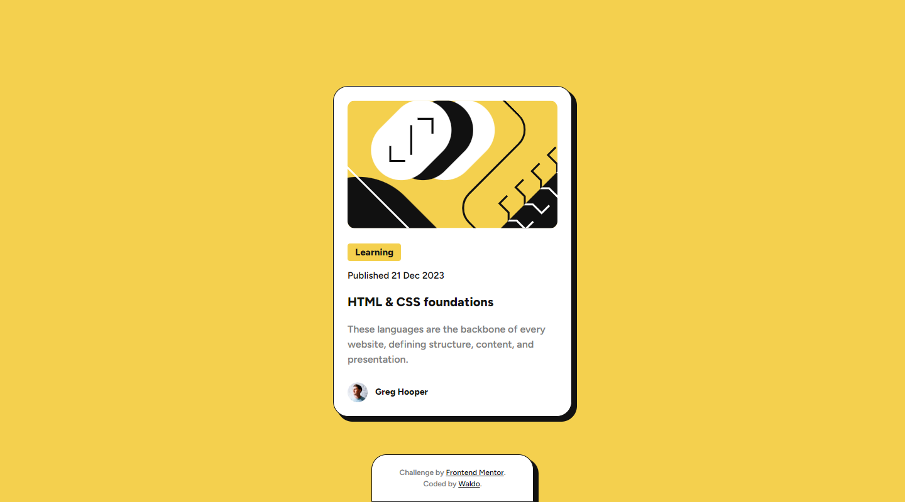

# Frontend Mentor - Blog preview card solution

This is a solution to the [Blog preview card challenge on Frontend Mentor](https://www.frontendmentor.io/challenges/blog-preview-card-ckPaj01IcS). Frontend Mentor challenges help you improve your coding skills by building realistic projects.

## Table of contents

- [Overview](#overview)
  - [The challenge](#the-challenge)
  - [Screenshot](#screenshot)
  - [Links](#links)
- [My process](#my-process)
  - [Built with](#built-with)
  - [Continued development](#continued-development)
- [Author](#author)

## Overview

### The challenge

Users should be able to:

- See hover and focus states for all interactive elements on the page

### Screenshot

### Links

- Solution URL: [GitHub Repo](https://github.com/waldosmuts/url-shortening-api)
- Live Site URL: [Live Preview](https://shortlyfi.netlify.app/)

## My process

### Built with

- Semantic HTML5 markup
- Vanilla CSS
- Flexbox

### Continued development

I want to keep challenging myself.

## Author

- Portfolio - [Waldo Smuts](https://waldosmuts.netlify.app)
- Frontend Mentor - [@waldosmuts](https://www.frontendmentor.io/profile/waldosmuts)
